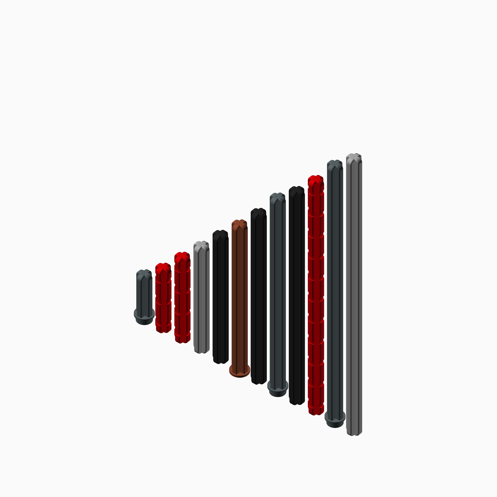

## Module `Technic.scad`

An OpenSCAD Technic-compatible piece generator. It currently supports generation of beams, axles, pin connectors, axle pins, elbows, and gears.

### Brief content:

**Functions**:

> [`technic_axle();`](#function-technic_axle): Technic, Axle [x]L [with Stud|Stop]

> [`technic_axle_and_pin_connector();`](#function-technic_axle_and_pin_connector): Technic, Axle and Pin Connector Perpendicular

> [`technic_axle_connector();`](#function-technic_axle_connector): Technic, Axle Connector [x]L [(Ridged)]

> [`technic_connector_hub();`](#function-technic_connector_hub): Technic, Axle and Pin Connector

> [`technic_axle_pin();`](#function-technic_axle_pin): Technic, Axle [x]L with Pin [x]L [with Friction Ridges]

> [`technic_beam();`](#function-technic_beam): Technic, Liftarm [Thick] [x]x[x] - [x]

> [`technic_bush();`](#function-technic_bush): Technic Bush

> [`technic_elbow();`](#function-technic_elbow): Brick, Round Tube 1 x 1 d. 90 degrees Elbow Macaroni

> [`technic_gear_double_sided();`](#function-technic_gear_double_sided): Technic, Gear [x] Tooth with [x] Axle Hole

> [`technic_gear_single_sided();`](#function-technic_gear_single_sided): Technic, Gear [x] Tooth Bevel

> [`technic_pin();`](#function-technic_pin): Technic, Pin [with Friction Ridges]

> [`technic_pin_connector();`](#function-technic_pin_connector): Technic, Liftarm Thick 1 x 1 (Spacer)

> [`technic_tire();`](#function-technic_tire): Tyre

> [`technic_wheel();`](#function-technic_wheel): Wheel

> [`technic_worm_gear();`](#function-technic_worm_gear): Technic, Gear Worm Screw

## Functions

The module `Technic.scad` defines the following functions.

### Function `technic_axle();`

Generate a Technic-compatible axle.
The origin is centered at the bottom of the axle.

**Part Support:**
- `part #3704`:  technic_axle( length = 2 );
- `part #3705`:  technic_axle( length = 4 );
- `part #3706`:  technic_axle( length = 6 );
- `part #3707`:  technic_axle( length = 8 );
- `part #3708`:  technic_axle( length = 12 );
- `part #3737`:  technic_axle( length = 10 );
- `part #4519`:  technic_axle( length = 3 );
- `part #6587`:  technic_axle( length = 3, stud = true );
- `part #15462`: technic_axle( length = 5, stop = true );
- `part #23948`: technic_axle( length = 11 );
- `part #24316`: technic_axle( length = 3, stop = true );
- `part #32073`: technic_axle( length = 5 );
- `part #44294`: technic_axle( length = 7 );
- `part #50450`: technic_axle( length = 32 );
- `part #50451`: technic_axle( length = 16 );
- `part #55013`: technic_axle( length = 8, stop = true );
- `part #60485`: technic_axle( length = 9 );
- `part #87073`: technic_axle( length = 4, stop = true );

**Parameters:**

- `length`: *float*  The length of the axle, in Technic units.
- `stop`: *bool* Whether there is a stop at the end.
- `stud`: *bool* Whether there is a stud at the end.

**Returns:**

No return

Back to [module description](#module-technicscad).

### Function `technic_axle_and_pin_connector();`

Generate a Technic-compatible axle and pin connector.
Axle and pin connectors: they connect axles to pins.
The origin is centered underneath the first axle hole.

**Part Support:**
- `part #32184`: technic_axle_and_pin_connector( length = 3 );

**Parameters:**

- `length`: *float* The length of the connector, in Technic holes.
- `height`: *float* The height of the connector, in multiples of standard connector heights.

**Returns:**

No return

Back to [module description](#module-technicscad).

### Function `technic_axle_connector();`

Generate a Technic-compatible axle connector.
Origin is centered at the bottom center of the axle connector.

**Part Support:**
- `part #6538a`: technic_axle_connector( length = 2, ridged = true )
- `part #6538c`: technic_axle_connector( length = 2 )

**Parameters:**

- `length`: *int* The length of the axle connector, in Technic units.
- `ridged`: *bool* Whether the connector should have ridges on it.

**Returns:**

No return

Back to [module description](#module-technicscad).

### Function `technic_connector_hub();`

A connector hub. Some sort of round connector with things like axles or pins protruding like spokes.
The origin is centered underneath the hub.
@todo I haven't measured this in real life to confirm dimensions.

**Part Support:**
- `part #4450`:  technic_connector_hub( hub_type = "pin", spoke_angles = [ 0, 168.75 ], spoke_lengths = [ 1, 1 ], spoke_heights = [ 1, 1 ], spoke_types = [ "axle connector", "axle connector" ] )
- `part #6611`:  technic_connector_hub( hub_type = "pin", spoke_angles = [ 0, 120, 240 ], spoke_lengths = [ 1, 1, 1 ], spoke_heights = [ 1, 1, 1 ], spoke_types = [ "axle connector", "axle connector", "axle connector" ] )
- `part #7329`:  technic_connector_hub( hub_type = "pin", spoke_angles = [ 0, 60, 180 ], spoke_lengths = [ 1, 1, 1 ], spoke_heights = [ 1, 1, 1 ], spoke_types = [ "axle connector", "axle connector", "axle connector" ] )
- `part #5713`:  technic_connector_hub( spoke_angles = [ 0 ], spoke_lengths = [ 1 ], spoke_heights = [ 1 ], spoke_types = [ "axle" ], spoke_lengths = [ 3 ] )
- `part #10197`: technic_connector_hub( spoke_angles = [ 0, 90 ] )
- `part #10288`: technic_connector_hub( hub_type = "pin", spoke_angles = [ 0, 60, 120, 180 ], spoke_lengths = [ 1, 1, 1, 1 ], spoke_heights = [ 1, 1, 1, 1 ], spoke_types = [ "axle connector", "axle connector", "axle connector", "axle connector" ] )
- `part #15100`: technic_connector_hub( hub_type = "pin", spoke_lengths = [ 1 ], spoke_angles = [ 0 ], spoke_heights = [ 1 ], spoke_types = [ "pin" ])
- `part #15460`: technic_connector_hub( hub_type = "pin", spoke_lengths = [ 1, 1, 1 ], spoke_angles = [ 0, 90, 180 ], spoke_heights = [ 1, 1, 1 ], spoke_types = [ "tow ball", "tow ball", "tow ball" ] );
- `part #22961`: technic_connector_hub( spoke_angles = [ 0 ], spoke_lengths = [ 1 ], spoke_heights = [ 1 ], spoke_types = [ "axle" ] )
- `part #27940`: technic_connector_hub( spoke_angles = [ 0, 180 ] )
- `part #32013`: technic_connector_hub( hub_type = "pin", spoke_angles = [ 0 ], spoke_lengths = [ 1 ], spoke_heights = [ 1 ], spoke_types = [ "axle connector" ] )
- `part #32014`: technic_connector_hub( hub_type = "pin", spoke_angles = [ 0, 90 ], spoke_lengths = [ 1, 1 ], spoke_heights = [ 1, 1 ], spoke_types = [ "axle connector", "axle connector" ] )
- `part #32015`: technic_connector_hub( hub_type = "pin", spoke_angles = [ 0, 157.5 ], spoke_lengths = [ 1, 1 ], spoke_heights = [ 1, 1 ], spoke_types = [ "axle connector", "axle connector" ] )
- `part #32016`: technic_connector_hub( hub_type = "pin", spoke_angles = [ 0, 112.5 ], spoke_lengths = [ 1, 1 ], spoke_heights = [ 1, 1 ], spoke_types = [ "axle connector", "axle connector" ] )
- `part #32034`: technic_connector_hub( hub_type = "pin", spoke_angles = [ 0, 180 ], spoke_lengths = [ 1, 1 ], spoke_heights = [ 1, 1 ], spoke_types = [ "axle connector", "axle connector" ] )
- `part #32192`: technic_connector_hub( hub_type = "pin", spoke_angles = [ 0, 135 ], spoke_lengths = [ 1, 1 ], spoke_heights = [ 1, 1 ], spoke_types = [ "axle connector", "axle connector" ] )
- `part #24122`: technic_connector_hub( hub_type = "axle", spoke_types = [ "bar connector", "bar connector" ] )
- `part #57585`: technic_connector_hub( hub_type = "axle", spoke_lengths = [ 1, 1, 1 ], spoke_angles = [ 0, 120, 240 ], spoke_heights = [ 1, 1, 1 ], spoke_types = [ "axle", "axle", "axle" ] )
- `part #87082`: technic_connector_hub( hub_type = "pin", spoke_lengths = [ 1, 1 ], spoke_angles = [ 0, 180 ], spoke_heights = [ 1, 1 ], spoke_types = [ "pin", "pin" ])

**Parameters:**

- `hub_height`: *int* The height of the hub, in Technic units.
- `hub_type`: *string* What type of hub should it be? Either "axle" or "pin".
- `spoke_lengths`: *float[]* How long should each spoke be?
- `spoke_angles`: *float[]* At what angle should each spoke connect?
- `spoke_heights`: *float[]* How high up on the hub should each spoke be placed?
- `spoke_types`: *string[]* What type of connector should each spoke be? Either "axle", "axle connector", "pin", "bar connector" or "tow ball"

**Returns:**

No return

Back to [module description](#module-technicscad).

### Function `technic_axle_pin();`

Generate a Technic-compatible axle pin.
The origin is centered at the bottom of the axle.

**Part Support:**
- `part #11214`: technic_axle_pin( axle_length = 1, pin_length = 2 );

**Parameters:**

- `axle_length`: *int* In studs, how long the axle component should be.
- `pin_length`: *int* In studs, how long the pin component should be.
- `friction`: *bool* Whether the pin component should have friction ridges on it.

**Returns:**

No return

Back to [module description](#module-technicscad).

### Function `technic_beam();`

Generate a Technic-compatible beam.
Origin is below the center of the first hole.

**Part Support:**
- `part #6629`:  technic_beam( length = 9, angles = [ 53.5 ], vertices = [ 6 ], axle_holes = [ 1, 9 ] )
- `part #6632`:  technic_beam( length = 3, height = 1/2, axle_holes = [ 1, 3 ] )
- `part #7229`:  technic_beam( length = 3, axle_holes = [ 2 ] )
- `part #11478`: technic_beam( length = 5, height = 1/2, axle_holes = [1, 5] )
- `part #18654`: technic_beam( length = 1 ) [equivalent to a pin connector]
- `part #32009`: technic_beam( length = 12, vertices = [ 3, 6 ], angles = [ 45, 45 ], axle_holes = [ 1, 12 ] );
- `part #32017`: technic_beam( length = 5, height = 1/2 )
- `part #32056`: technic_beam( length = 5, height = 1/2, angles = [ 90 ], vertices = [ 3 ], axle_holes = [ 1, 3, 5 ] )
- `part #32063`: technic_beam( length = 6, height = 1/2 )
- `part #32065`: technic_beam( length = 7, height = 1/2 )
- `part #32140`: technic_beam( length = 5, angles = [ 90 ], vertices = [ 4 ], axle_holes = [ 1 ] )
- `part #32271`: technic_beam( length = 9, angles = [ 53.5 ], vertices = [ 7 ], axle_holes = [ 1, 9 ] )
- `part #32278`: technic_beam( length = 15 )
- `part #32316`: technic_beam( length = 5 )
- `part #32348`: technic_beam( length = 7, angles = [ 53.5 ], vertices = [ 4 ], axle_holes = [ 1, 7 ] )
- `part #32449`: technic_beam( length = 4, height = 1/2, axle_holes = [ 1, 4 ] )
- `part #32523`: technic_beam( length = 3 )
- `part #32524`: technic_beam( length = 7 )
- `part #32525`: technic_beam( length = 11 )
- `part #32526`: technic_beam( length = 7, angles = [ 90 ], vertices = [ 1 ] )
- `part #40490`: technic_beam( length = 9 )
- `part #41239`: technic_beam( length = 13 )
- `part #41677`: technic_beam( length = 2, height = 1/2, axle_holes = [ 1, 2 ] )
- `part #43857`: technic_beam( length = 2 )
- `part #60483`: technic_beam( length = 2, axle_holes = [ 1 ] )
- `part #77107`: technic_beam( length = 33, axle_holes = [ 1, 17 ], angles = [ 11.25,11.25,11.25,11.25,11.25,11.25,11.25,11.25,11.25,11.25,11.25,11.25,11.25,11.25,11.25,11.25,11.25,11.25,11.25,11.25,11.25,11.25,11.25,11.25,11.25,11.25,11.25,11.25,11.25,11.25,11.25 ], vertices = [ 2,3,4,5,6,7,8,9,10,11,12,13,14,15,16,17,18,19,20,21,22,23,24,25,26,27,28,29,30,31,32 ] ); // This is roughly equivalent but not visually identical.

**Parameters:**

- `length`: *int* The number of holes in the beam.
- `height`: *float* How tall (in multiples of technic beam thicknesses) should the beam be?
- `angles`: *float[]* The change in angle (clockwise) that will occur at the vertex'th hole.
- `vertices`: *int[]* The number of each hole at which the angle should change.
- `axle_holes`: *int[]* Which holes should be axle holes instead.

**Returns:**

No return

Back to [module description](#module-technicscad).

### Function `technic_bush();`

Generate a Technic-compatible bush.
Origin is centered beneath the bush.

**Part Support:**
- `part #3713`:  technic_bush( height = 1 )
- `part #4265c`: technic_bush( height = 1/2 );

**Parameters:**

- `height`: *int* The height of the bush.
- `stud_cutouts`: *bool* Whether one end should have cutouts in the edge to fit between studs. Only applies to heights greater than 1/2.

**Returns:**

No return

Back to [module description](#module-technicscad).

### Function `technic_elbow();`

Generate a Technic-compatible 90º elbow.
Origin is at the point where the X and Y axes would meet, with each of them centered in the hole at the end of each leg of the elbow.

**Part Support:**
- `part #25214`: technic_elbow( length = 2, width = 2 )

**Parameters:**

- `length`: *int* The number of studs one leg would cover, if laid down on a plate.
- `width`: *int* The number of studs the other leg would cover, if laid down on a plate.
- `axle_socket_on_length`: *bool* Whether there should be an interior socket for accepting an axle on the X axis.
- `axle_socket_on_width`: *bool* Whether there should be an interior socket for accepting an axle on the Y axis.

**Returns:**

No return

Back to [module description](#module-technicscad).

### Function `technic_gear_double_sided();`

Generate a Technic-compatible double-sided spur gear.
Double-sided gears (as opposed to the one-sided gears sometimes called "half-gears").
Origin is at the center of the gear in all directions.

**Part Support:**
- `part #3647`:  technic_gear_double_sided( teeth = 8, width = 1.5 ); // @todo Multiple issues.
- `part #3648`:  technic_gear_double_sided( teeth = 24 );
- `part #3549`:  technic_gear_double_sided( teeth = 40 );
- `part #10928`: technic_gear_double_sided( teeth = 8, width = 1.5 ); // @todo The teeth are not exactly right.

**Parameters:**

- `teeth`: *int* How many teeth should the gear have? The minimum reasonable value is probably X.
- `width`: *int* In multiples of the original gear width, how wide should it be? e.g., a width of 3 would generate a single gear with the same total width as three gears set side-by-side.

**Returns:**

No return

Back to [module description](#module-technicscad).

### Function `technic_gear_single_sided();`

Generate a single-sided gear, sometimes called a half-gear.
Origin is centered at the bottom of the gear (the non-toothed side).

**Part Support:**
- `part #6589`:  technic_gear_single_sided()
- `part #32198`: technic_gear_single_sided( teeth = 20 )
- `part #87407`: technic_gear_single_sided( teeth = 20, center_hole = "pin" )

**Parameters:**

- `teeth`: *int* How many teeth should the gear have? The minimum reasonable value is probably 10.
- `bevel`: *bool* Should the gear teeth be beveled?
- `center_hole`: *string* What connector should the center hole be compatible with? Supported values are "axle" and "pin".

**Returns:**

No return

Back to [module description](#module-technicscad).

### Function `technic_pin();`

Generate a Technic-compatible pin.
Origin is centered at the bottom of the pin.

**Part Support:**
- `part #2780`:  technic_pin( top_length = 1, top_friction = true, bottom_length = 1, bottom_friction = true )
- `part #3673`:  technic_pin( top_length = 1, top_friction = false, bottom_length = 1, bottom_friction = false )
- `part #4274`:  technic_pin( top_length = 1, stud = true )
- `part #4459`:  technic_pin( top_length = 1, top_friction = true, bottom_length = 1, bottom_friction = true ) // This part has long friction ridges along the length of the pin, which isn't supported yet.
- `part #6558`:  technic_pin( top_length = 2, top_friction = true, bottom_length = 1, bottom_friction = true )
- `part #6628`:  technic_pin( bottom_type = "tow ball" )
- `part #32054`: technic_pin( top_length = 2, bottom_length = 1, bottom_type = "bush" )
- `part #32138`: technic_pin( multiplier = 2 )
- `part #32556`: technic_pin( top_length = 2, top_friction = false, bottom_length = 1, bottom_friction = false )
- `part #65098`: technic_pin( multiplier = 2, squared_pin_holes = true )
- `part #77765`: technic_pin( top_length = 3, top_friction = false, bottom_length = 0, bottom_friction = false )
- `part #80477`: technic_pin( bottom_length = 2, bottom_type = "tow ball" )
- `part #89678`: technic_pin( top_length = 1, top_friction = true, bottom_type = "stud" )

**Parameters:**

- `top_length`: *float* How long is the pin on the top?
- `top_friction`: *bool* Should the top part have friction ridges?
- `bottom_type`: *string* What should the bottom of the pin be? "pin", "tow ball", "stud", or "bush"
- `bottom_length`: *float* How long is the pin on the bottom?
- `bottom_friction`: *bool* Should the bottom part have friction ridges?
- `multiplier`: *int* How many pin sets should there be?
- `axle_hole`: *bool* If a multiple pin, should there be an axle hole?

**Returns:**

No return

Back to [module description](#module-technicscad).

### Function `technic_pin_connector();`

Generate a Technic-compatible pin connector.
Origin is centered at the bottom center of the pin connector.

**Part Support:**
- `part #18654`: technic_pin_connector( length = 1 ) [equivalent to a 1-hole beam]

**Parameters:**

- `length`: *int* The length of the pin connector in "studs." FWIW, LEGO only makes these in length 1.

**Returns:**

No return

Back to [module description](#module-technicscad).

### Function `technic_tire();`

Generate a Technic-compatible tire.
@todo Tread pattern.
@todo Inner band

**Parameters:**

- `tread_width`: *float* Width of the tire tread.
- `diameter`: *float* Outer diameter of the tire.
- `tread_thickness`: *float* Thickness of the tire tread.

**Returns:**

No return

Back to [module description](#module-technicscad).

### Function `technic_wheel();`

Generate a Technic-compatible wheel (also referred to as rims).
@todo Fake studs.
@todo spokes aren't curved downward.
@todo Multiple grooves.

**Parameters:**

- `diameter`: *float* The diameter of the wheel.
- `width`: *float* The width of the wheel, across where the tread would lie.
- `center_groove`: *bool* Whether it has a center groove for holding a tire in place.
- `hole_type`: *string* Is the center hole for an "axle" or a "pin"?
- `spoke_count`: *int* How many spokes should it have?
- `spoke_style`: *string* What style of spoke does it have? Only "double" is supported now.

**Returns:**

No return

Back to [module description](#module-technicscad).

### Function `technic_worm_gear();`

Generate a Technic-compatible worm gear.

**Part Support:**
- `part #4716`:  technic_worm_gear( height = 2, width = 3 );                    // 10mm   wide, 16mm   tall
- `part #27938`: technic_worm_gear( height = 1, width = 4 );                    // 13.5mm wide, 8mm    tall
- `part #32905`: technic_worm_gear( height = 2, width = 3, opening = "axle2" ); // 10mm   wide, 15.7mm tall

**Parameters:**

- `height`: *float* The height of the gear, in Technic units.
- `width`: *int* The width of the gear, in some unknown units. The two real-world Technic worm gears seem to be roughly multiples of 3.5mm (3x and 4x), and values outside of 3-5 don't really work.
- `opening`: *string* Whether the opening should be axle shaped, or the half-axle/half-circle shape that some new gears use. "axle" or "axle2"

**Returns:**

No return

Back to [module description](#module-technicscad).

Back to [top](#).

