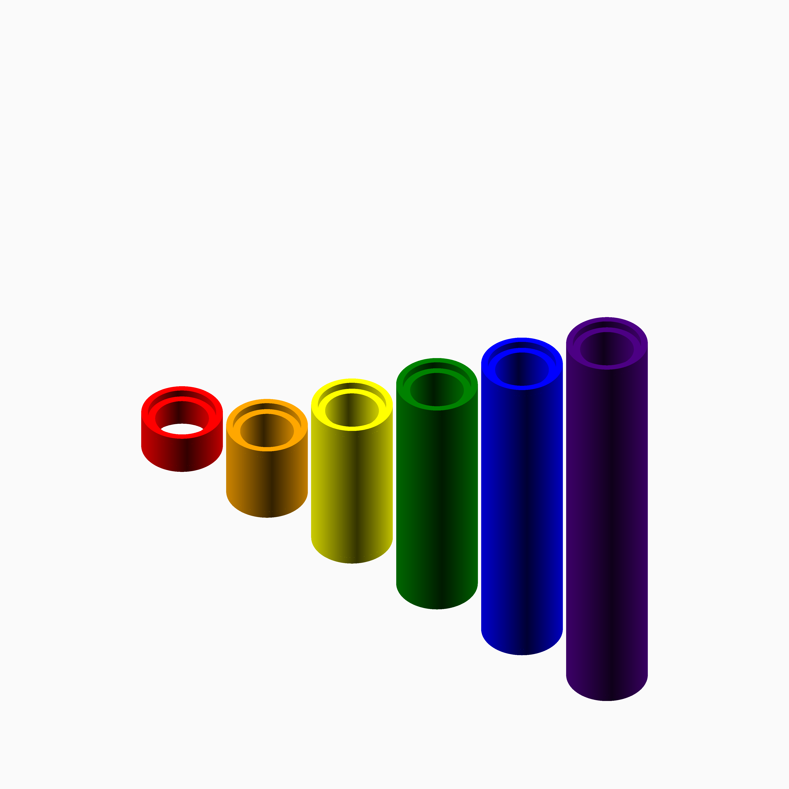

# Technic.scad

An OpenSCAD Technic-compatible piece generator. It currently supports generation of axles and pin connectors.

Modules
=======

`technic_axle();`
-----------------

Generate a Technic-compatible axle.

| Parameter | Values| Description |
|---|---|---|
| `length` | int | The length of the axle in "stud widths." |

`technic_pin_connector();`
--------------------------

| Parameter | Values| Description |
|---|---|---|
| `length` | int | The length of the pin connector in "stud widths." FWIW, LEGO only makes these in length 1. |

