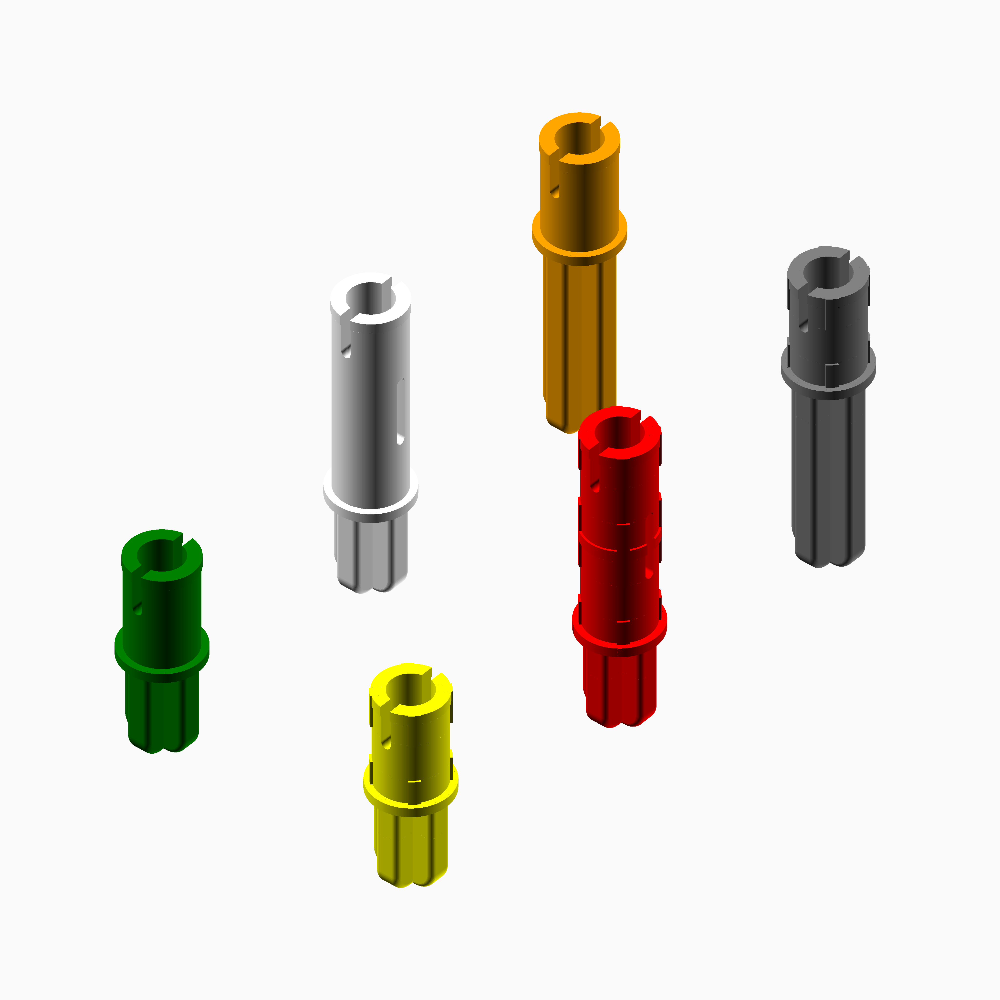

# Technic.scad

An OpenSCAD Technic-compatible piece generator. It currently supports generation of axles, pin connectors, axle pins, and 24-tooth gears.

Modules
=======

`technic_axle();`
-----------------

Generate a Technic-compatible axle.

| Parameter | Values| Description |
|---|---|---|
| `length` | int | The length of the axle in "studs." |

`technic_pin_connector();`
--------------------------

| Parameter | Values| Description |
|---|---|---|
| `length` | int | The length of the pin connector in "studs." FWIW, LEGO only makes these in length 1. |

`technic_24_tooth_gear();`
--------------------------

| Parameter | Values| Description |
|---|---|---|
| `width` | int | In multiples of the original gear width, how wide should it be? e.g., a width of 3 would generate a single gear with the same total width as three gears set side-by-side. |

`technic_axle_pin();`
--------------------------

| Parameter | Values| Description |
|---|---|---|
| `axle_length` | int | In studs, how long the axle component should be. |
| `pin_length` | int | In studs, how long the pin component should be. |
| `friction` | bool | Whether the pin component should have friction ridges on it. |

`technic_pin();`
--------------------------

| Parameter | Values| Description |
|---|---|---|
| `top_length` | int | In studs, how long the top half of the pin should be. |
| `top_friction` | bool | Whether the top half of the pin should have friction ridges on it. |
| `bottom_length` | int | In studs, how long the bottom half of the pin should be. |
| `bottom_friction` | bool | Whether the bottom half of the pin should have friction ridges on it. |
